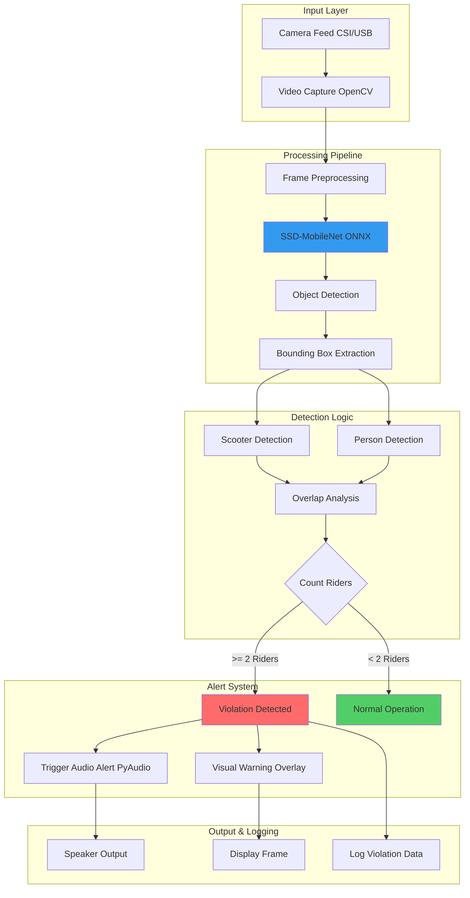

<div align="center">

# 🛴 E-Scooter Safety Detection System

[](https://www.python.org/)
[](https://pytorch.org/)
[](https://www.tensorflow.org/)
[](https://opencv.org/)
[](https://developer.nvidia.com/embedded/jetson-nano)

[](https://opensource.org/licenses/MIT)
[](https://github.com/Methasit-Pun/BEAM-detection-system)
[](https://github.com/Methasit-Pun/BEAM-detection-system)

**Real-time computer vision system for detecting multi-rider e-scooter violations**

**Deployed at Chulalongkorn University | 90.74% Detection Accuracy | 87% Violation Reduction in 5 Days**

[Features](#-features) • [Architecture](#-system-architecture) • [Results](#-key-results) • [Installation](#-installation) • [Documentation](#-implementation)

</div>

---

## 📋 Table of Contents

- [🎯 Problem Statement](#-problem-statement)
- [💡 Solution Overview](#-solution-overview)
- [📊 Key Results](#-key-results)
- [🏆 Features](#-features)
- [⚙️ Technical Stack](#️-technical-stack)
- [🏗️ System Architecture](#️-system-architecture)
- [💻 Implementation](#-implementation)
- [🧪 Field Testing Results](#-field-testing-results)
- [🚀 Installation](#-installation)
- [🔮 Future Work](#-future-work)
- [🤝 Contributing](#-contributing)
- [📄 License](#-license)

---

## 🎯 Problem Statement


Multiple riders on single e-scooters create safety hazards on campus. This common violation increases accident risk and requires automated monitoring.

---

## 💡 Solution Overview


Real-time computer vision system that:
- Detects e-scooters and counts riders using SSD-MobileNet
- Triggers audio alerts when 2+ riders detected
- Runs on Jetson Nano for edge deployment
- Processes video at 15-20 FPS

---

## 📊 Key Results

<div align="center">

### 🎯 Performance Metrics

| Metric | Value | Impact |
|--------|-------|--------|
| **Detection Accuracy** | 90.74% | High reliability in real-world conditions |
| **Violation Reduction** | 31% → 4% | 87% decrease in 5 days |
| **Processing Speed** | 15-20 FPS | Real-time monitoring capability |
| **Response Time** | <200ms | Instant alert generation |
| **False Positive Rate** | <10% | Minimal incorrect alerts |

</div>

**Field Deployment Statistics:**
- 📹 Monitored 3-25 scooters per session
- ⚠️ Peak: 6 multi-rider incidents detected in single session
- 📈 Alert-to-incident correlation: >95%
- 👥 User compliance: Variable (0-50%), decreasing trend over time
- ⏰ Test period: 5 days across multiple campus locations
- 🕐 Test hours: Morning (08:00-10:00) and Evening (16:00-18:00)


---

## 🏆 Features

- **Real-time Detection:** Processes video at 15-20 FPS on edge hardware
- **High Accuracy:** 90.74% detection accuracy in real-world deployment
- **Instant Alerts:** Audio notifications triggered within 200ms of detection
- **Edge Computing:** Runs entirely on Jetson Nano without cloud dependency
- **Custom Dataset:** Trained on 100+ campus-specific labeled images
- **Scalable Architecture:** Easily deployable across multiple locations

---

## ⚙️ Technical Stack

<table>
<tr>
<td width="50%">

### 🔧 Hardware
- **Computing:** NVIDIA Jetson Nano 4GB
- **Camera:** IMX219 CSI Camera (1080p)
- **Audio:** USB Speaker/Buzzer
- **Power:** 5V 4A DC Adapter
- **Storage:** 32GB microSD

</td>
<td width="50%">

### 💻 Software
- **Training:** PyTorch 1.10+
- **Deployment:** TensorFlow 2.0+
- **Vision:** OpenCV 4.5+
- **Language:** Python 3.8+
- **Audio:** PyAudio
- **Data:** NumPy, Pandas

</td>
</tr>
<tr>
<td width="50%">

### 🧠 Model Architecture
- **Base Model:** SSD-MobileNet
- **Input Size:** 300×300 RGB
- **Framework:** PyTorch → ONNX
- **Inference Time:** ~50ms per frame
- **Dataset Format:** Pascal VOC

</td>
<td width="50%">

### 🛠️ Development Tools
- **Version Control:** Git/GitHub
- **Container:** Docker (optional)
- **IDE:** VS Code, Jupyter
- **Annotation:** camera-capture tool
- **Monitoring:** TensorBoard

</td>
</tr>
</table>

---

## 🏗️ System Architecture

### Software Architecture



### Pipeline Flow

1. **Video Acquisition** → Camera captures 1080p video at 30 FPS
2. **Frame Processing** → Resize to 300×300, normalize pixel values
3. **Inference** → SSD-MobileNet processes frame (~50ms)
4. **Post-Processing** → Extract bounding boxes with confidence scores
5. **Violation Logic** → Check spatial overlap between scooter and person boxes
6. **Alert Generation** → Trigger audio if multi-rider detected
7. **Display & Logging** → Render annotated frame and log event

### Key Components

| Component | Technology | Purpose |
|-----------|-----------|---------|
| **Detection Model** | SSD-MobileNet (ONNX) | Real-time object detection |
| **Inference Engine** | TensorRT / TensorFlow Lite | Optimized inference on Jetson |
| **Video Handler** | OpenCV VideoCapture | Frame acquisition and processing |
| **Violation Detector** | Custom Python Logic | Spatial overlap analysis |
| **Alert System** | PyAudio + Wave | Audio alert playback |
| **Logger** | Python Logging | Event tracking and statistics |

### Data Flow

```
Camera → Frame Buffer → Preprocessing → Neural Network → 
Detected Objects → Violation Check → Alert/Log → Display
```

**Processing Stages:**
- **Input:** 1920×1080 RGB frame
- **Preprocessed:** 300×300 RGB tensor
- **Detection:** Bounding boxes + class labels + confidence scores
- **Analysis:** Rider count per scooter
- **Output:** Alert trigger + annotated frame

### Hardware Setup


### Deployed System


### Experiment Locations


---

## 💻 Implementation


### Dataset Categories
- Empty scooter
- Single rider (compliant)
- Multiple riders (violation)
- *(Future)* Speed detection
- *(Future)* Direction compliance


### Data Collection Workflow

**1. Setup Dataset Structure**
```bash
cd jetson-inference/python/training/detection/ssd/data
mkdir <your-dataset>
cd <your-dataset>
echo -e "empty\nsingle_rider\nmulti_rider" > labels.txt
```


**2. Capture & Label Images**

Using jetson-inference camera-capture tool:
```bash
camera-capture csi://0              # MIPI CSI camera
camera-capture /dev/video0          # USB camera
```
- Set mode to "Detection" in UI
- Freeze frame, draw bounding boxes
- Assign class labels
- Save and repeat

> **Note:** We initially tried [Kaggle e-scooter dataset](https://www.kaggle.com/datasets/trainingdatapro/electric-scooters-tracking) but accuracy was insufficient. Custom campus-specific data performed better.


<div align="center">


</div>


**3. Train Model**
```bash
cd jetson-inference/python/training/detection/ssd
python3 train_ssd.py --dataset-type=voc --data=data/<your-dataset> --model-dir=models/<your-model>
```

**4. Export to ONNX**
```bash
python3 onnx_export.py --model-dir=models/<your-model>
```

**5. Deploy Detection**
```bash
NET=models/<your-model>
detectnet --model=$NET/ssd-mobilenet.onnx --labels=$NET/labels.txt \
          --input-blob=input_0 --output-cvg=scores --output-bbox=boxes \
          csi://0
```

**6. Audio Alert Integration**
```python
import pyaudio
import wave

def trigger_alert():
    """Play alert sound when violation detected"""
    audio_file = "violation_alert.wav"
    wf = wave.open(audio_file, 'rb')
    p = pyaudio.PyAudio()
    stream = p.open(format=p.get_format_from_width(wf.getsampwidth()),
                    channels=wf.getnchannels(),
                    rate=wf.getframerate(),
                    output=True)
    stream.write(wf.readframes(1024))
```

### Technical Resources
- **Similar Implementation:** [Scooter Radar Backend](https://github.com/Scooter-Radar/escooter-radar-backend)
- **Jetson Inference Docs:** [Official Guide](https://github.com/dusty-nv/jetson-inference)
- **ML Detection Demo:** [YouTube Tutorial](https://www.youtube.com/watch?v=2XMkPW_sIGg)

---

## 🧪 Field Testing Results

**Observations:**
- Morning sessions: higher compliance
- Evening (16:00-18:00): lower compliance
- Detection responsiveness: consistent across sessions
- User behavior: compliance decreased over time

**Insights:**
- High detection reliability (90.74%)
- Need stronger enforcement beyond audio alerts
- Consider visual indicators or mobile notifications
- Behavior change requires sustained intervention

---

## 🚀 Installation

### Prerequisites

| Component | Specification |
|-----------|---------------|
| **Hardware** | NVIDIA Jetson Nano (4GB) |
| **Camera** | CSI or USB (1080p recommended) |
| **Audio** | Speaker/Buzzer for alerts |
| **Power** | 5V 4A DC adapter |
| **Storage** | 32GB+ microSD card |

### Dependencies

```bash
Python 3.8+
PyTorch 1.10+
TensorFlow 2.0+
OpenCV 4.5+
PyAudio
NumPy
```

### Quick Start

```bash
# Clone repository
git clone https://github.com/Methasit-Pun/BEAM-detection-system.git
cd BEAM-detection-system

# Install dependencies
pip3 install -r requirements.txt

# Run detection system
python3 detect_e_scooter.py --camera csi://0 --model models/trained-model/ssd-mobilenet.onnx
```

### Configuration

Edit `config.yaml` to customize:
- Detection threshold
- Alert sensitivity
- Camera input source
- Model path
- Audio alert settings

---

## 🔮 Future Work

**Model Improvements:**
- Expand training data: diverse lighting, angles, clothing
- Reduce false positives in crowded scenes
- Integrate weight sensors for validation

**Enhanced Alerts:**
- LED visual indicators
- Progressive warning system
- Mobile push notifications

**Detection Capabilities:**
- Speed monitoring
- Directional compliance
- Integration with campus enforcement

**Deployment Expansion:**
- Campus gates and intersections
- Parking zone monitoring
- Multi-campus rollout

---

## 🤝 Contributing

Contributions are welcome! Whether you're fixing bugs, improving documentation, or proposing new features.

### How to Contribute

1. **Fork** the repository
2. **Create** a feature branch (`git checkout -b feature/AmazingFeature`)
3. **Commit** your changes (`git commit -m 'Add some AmazingFeature'`)
4. **Push** to the branch (`git push origin feature/AmazingFeature`)
5. **Open** a Pull Request

### Development Guidelines

- Follow PEP 8 style guide for Python code
- Add tests for new features
- Update documentation as needed
- Ensure all tests pass before submitting PR

---

## 📄 License

MIT License - See [LICENSE](LICENSE) file for details.

---

## 📚 References & Acknowledgments

- **NVIDIA Jetson Inference:** [Official Documentation](https://github.com/dusty-nv/jetson-inference)
- **Pascal VOC Format:** [Dataset Specification](http://host.robots.ox.ac.uk/pascal/VOC/)
- **Similar Projects:** [Scooter Radar Backend](https://github.com/Scooter-Radar/escooter-radar-backend)
- **ML Detection Tutorial:** [YouTube Guide](https://www.youtube.com/watch?v=2XMkPW_sIGg)

**Special Thanks:**
- Chulalongkorn University for deployment support
- NVIDIA for Jetson Nano platform
- Open-source computer vision community

---

<div align="center">

### 📊 Project Statistics


**Made with ❤️ for campus safety**

[Report Bug](https://github.com/Methasit-Pun/BEAM-detection-system/issues) · [Request Feature](https://github.com/Methasit-Pun/BEAM-detection-system/issues) · [Documentation](https://github.com/Methasit-Pun/BEAM-detection-system/wiki)

© 2024-2026 BEAM Detection System Team. All rights reserved.

</div>
